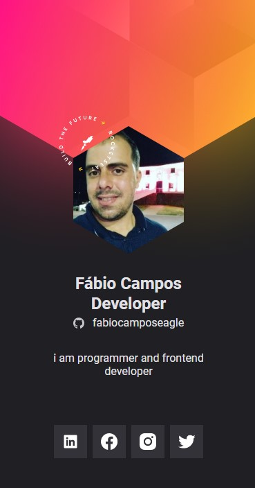

<h2 align='center'> 
   Hello, world! I'm Fábio Campos 👋
</h2>
 
<i>❝I'm able to learn 1% every day programming something new.❞</i>

  

     
  

  

  This is my business card go to the link with SocialMedia
  

  

  https://fabiocamposeagle.github.io/virtual.badge/ 
  

   
  <h5 align="center">
  <code>
    <a target="_blank" href="https://www.linkedin.com/in/fábiocamposeagle" title="LinkedIn"> 
       LinkedIn
    </a>
  </code>
  
</h5>

     
- 💼 Currently learning a lot as a Developer at Udemy (https://www.udemy.com/course/curso-web/)
- I am also a student at Udemy Modern Web Course Complete with JavaScript 2021 + Projects
-  Master Web, 14 Courses + Projects, Javascript, Angular, React, Vue, Node, HTML, CSS, jQuery, Bootstrap Webpack Gulp MySQL

I'm learning angular technology applied by Google at the Pan bootcamp
in 2021 I participated in two bootcamps at the school https://online.igti.com.br/

-  2021-3 - Bootcamp Desenvolvedor(a) React
-  Bootcamp Desenvolvedor Tech PAN 

- 💌 For further clarification or invitations to contributions and partnerships,
- 💬 Ask me about job offers too
- 📫 How to reach me: fabioeagle72@gmail.com 
- 💬 You can ask me about anything, I will be happy to help: D
<!--## Sobre mim
- 💼 Atualmente aprendendo muito como Desenvolvedor na Udemy (https://www.udemy.com/course/curso-web/)
- Também sou estudante da Udemy Curso Web Moderno Completo com JavaScript 2021 + Projetos
  Domine Web, 14 Cursos + Projetos, Javascript, Angular, React, Vue, Node, HTML, CSS, jQuery, Bootstrap Webpack Gulp MySQL
 👩‍💻 Também sou estudante Full Stack pela [Labenu](https://www.labenu.com.br/) 
- 💌 Para maiores esclarecimentos ou convites para contribuições e parcerias,
- 💬 Pode me perguntar sobre qualquer coisa, ficarei feliz em ajudar :D
- -->

## TECHNOLOGY AND TOOLS
 
         

  

  
&nbsp;
&nbsp;
&nbsp;
&nbsp;
&nbsp;
&nbsp;
&nbsp;
&nbsp;
&nbsp;
&nbsp;
&nbsp;

  

 Thanks for your visit 😁

<!--
**fabiocamposeagle/fabiocamposeagle** is a ✨ _special_ ✨ repository because its `README.md` (this file) appears on your GitHub profile.

Here are some ideas to get you started:

- 🔭 I’m currently working on ...
- 🌱 I’m currently learning ...
- 👯 I’m looking to collaborate on ...
- 🤔 I’m looking for help with ...
- 💬 Ask me about ...
- 📫 How to reach me: ...
- 😄 Pronouns: ...
- ⚡ Fun fact: ...
-->

